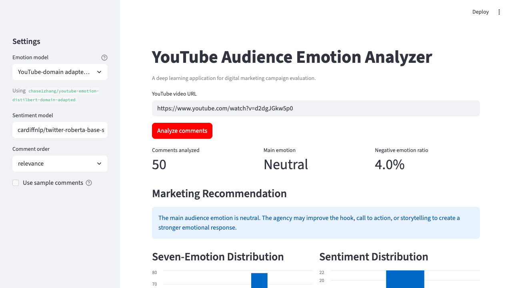
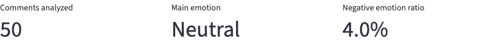
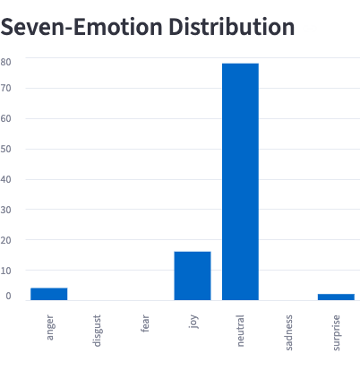
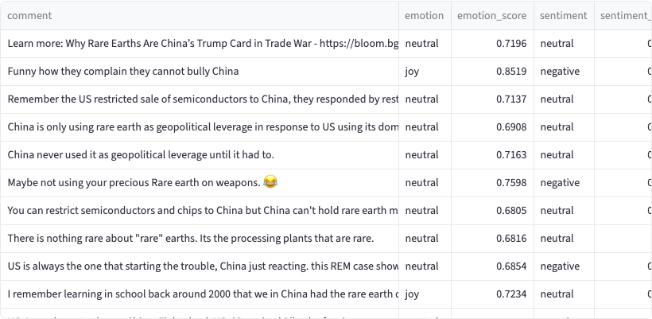
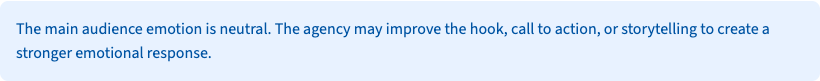
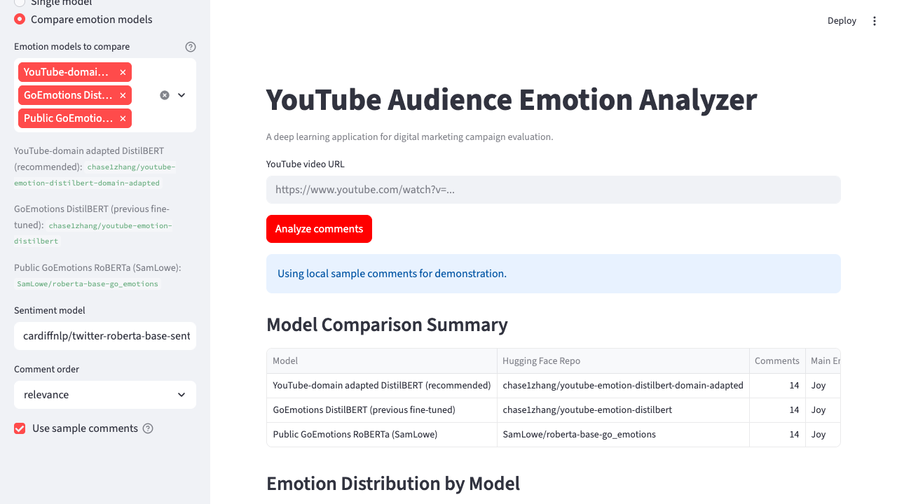

# YouTube Audience Emotion Analyzer for Digital Marketing Campaigns

## 1. Project Title and Student Names

**Project title:** YouTube Audience Emotion Analyzer for Digital Marketing Campaigns

**Student names:**
- ZHANG Xinchao, 21257618
- Yao Ziyue, 21260768

## 2. Company Name and Website URL

**Company:** Nike, Inc.

**Website:** https://www.nike.com

**Application URL:** https://youtube-emotion-analyzer.streamlit.app/

Nike runs large-scale YouTube marketing campaigns for product launches, athlete partnerships, and brand advertising. YouTube comments contain useful customer reactions, but manually reading comments is slow, subjective, and difficult to scale. This project builds a deep learning application that summarizes the main emotions in YouTube comments and turns them into practical marketing recommendations for Nike's digital marketing team.

## 3. Project Objective

This project helps Nike classify the first 100 comments under a YouTube video into seven emotions, summarize campaign reaction, flag negative feedback risk, and generate actionable recommendations for content and messaging improvement.

## 4. Strategy

The strategy is to build a Streamlit Cloud business application that accepts a YouTube video URL, retrieves the first 100 top-level comments through the YouTube Data API, and analyzes the comments with Hugging Face transformer pipelines.

The application uses two text classification pipelines:

1. A seven-emotion pipeline for detailed audience emotion analysis.
2. A three-class sentiment pipeline for a simpler positive / neutral / negative business signal.

The seven target emotions are anger, disgust, fear, joy, neutral, sadness, and surprise. The app calculates the dominant emotion, the full emotion distribution, the sentiment distribution, and a negative emotion ratio defined as anger + disgust + fear + sadness. The ratio is used as a campaign risk indicator. If negative emotions are high, the marketing team should review message framing, audience targeting, and potential public-reaction risks.

The dashboard provides:

- Main audience emotion
- Seven-emotion distribution chart
- Three-class sentiment distribution chart
- Three-model emotion comparison mode
- Negative emotion ratio metric
- Decision pipeline for campaign action and risk level
- Comment-level prediction table with model confidence scores
- Marketing recommendation text
- CSV download of all predictions

## 5. Model URL

**Primary deployed emotion model:** https://huggingface.co/chase1zhang/youtube-emotion-distilbert-domain-adapted

**Original fine-tuned emotion model:** https://huggingface.co/chase1zhang/youtube-emotion-distilbert

**Public GoEmotions fine-tuned comparison model:** https://huggingface.co/SamLowe/roberta-base-go_emotions

**Pre-tuning baseline emotion model:** https://huggingface.co/j-hartmann/emotion-english-distilroberta-base

**Optional larger seven-emotion model:** https://huggingface.co/j-hartmann/emotion-english-roberta-large

**Supporting sentiment model:** https://huggingface.co/cardiffnlp/twitter-roberta-base-sentiment-latest

**Alternative sentiment model (fast CPU):** https://huggingface.co/lxyuan/distilbert-base-multilingual-cased-sentiments-student

**Alternative sentiment model (social media):** https://huggingface.co/finiteautomata/bertweet-base-sentiment-analysis

The final Streamlit app defaults to the domain-adapted model because it was further trained with YouTube-domain comments. The app also includes a comparison mode that runs the same comments through three emotion models: the YouTube-domain adapted DistilBERT, the public SamLowe GoEmotions RoBERTa model, and the public j-hartmann DistilRoBERTa seven-emotion model. The original GoEmotions DistilBERT and the larger j-hartmann RoBERTa-large model remain available in the sidebar selector. For sentiment analysis, the app supports switching between three pre-trained models via a dropdown selector: CardiffNLP (recommended), lxyuan (fast CPU inference, multilingual), and FiniteAutomata BERTweet (robust on social media text).

## 6. App URL

**Deployed Streamlit Cloud app:** https://youtube-emotion-analyzer.streamlit.app/

## 7. GitHub URL

**GitHub repository:** https://github.com/chasezhang1999/youtube-emotion-analyzer

The repository is connected to Streamlit Cloud for automatic deployment. The YouTube Data API key is stored in Streamlit secrets and is not uploaded to GitHub.

## 8. Dataset

### 8.1 GoEmotions Fine-Tuning Dataset

The first training stage uses the GoEmotions dataset from Hugging Face:

- Dataset URL: https://huggingface.co/datasets/SetFit/go_emotions
- Input feature: `text`
- Target feature: seven-class emotion label
- Labels: anger, disgust, fear, joy, neutral, sadness, surprise

The raw GoEmotions dataset is multi-label. For this project, it was filtered to clean single-label examples and reduced to the seven target emotions. The training and test splits now use target-size stratified sampling without replacement, capped by available minority-class rows; validation remains class-balanced.

| Split | Samples | Class balance |
|---|---:|---|
| Train | 17,166 | Stratified; capped by available minority-class rows |
| Validation | 2,105 | Stratified |
| Test | 2,160 | Stratified; capped by available minority-class rows |

Preprocessing steps:

1. Keep examples where exactly one emotion label is active.
2. Keep only the seven project labels.
3. Convert label names to label IDs from 0 to 6.
4. Balance each split by class to avoid a majority-class model.

Prepared files:

- `data/go_emotions_7class/train.csv`
- `data/go_emotions_7class/validation.csv`
- `data/go_emotions_7class/test.csv`

### 8.2 YouTube-Domain Adaptation Dataset

Because Reddit-style GoEmotions text is different from YouTube comments, an additional YouTube-domain adaptation dataset was created. The updated collection contains an 8,000-comment DeepSeek AI-labeled raw pool from 71 YouTube videos related to technology, brands, entertainment, product issues, public announcements, brand purpose advertising, product launches, and audience reaction topics. From that pool, the final adaptation dataset selects 3,991 balanced comments.

The comments were labeled with DeepSeek v4pro AI annotation using the same seven emotion labels. These labels were used only for additional domain adaptation. The independent app evaluation still uses a separate manually reviewed set of 500 YouTube comments, so the reported app test is not measured on the training comments.

YouTube-domain label distribution:

| Label | Count |
|---|---:|
| anger | 714 |
| disgust | 292 |
| fear | 201 |
| joy | 714 |
| neutral | 714 |
| sadness | 714 |
| surprise | 642 |

Prepared files:

- `data/youtube_domain_7class_deepseek/all.csv`
- `data/youtube_domain_7class_deepseek/train.csv`
- `data/youtube_domain_7class_deepseek/validation.csv`
- `data/youtube_domain_training_comments_8000_deepseek_labeled.csv`

### 8.3 App Testing Dataset

The deployed app was evaluated on 500 comments across 10 YouTube videos (50 comments per video). Of these, 150 comments from 3 videos were manually reviewed by humans, and 350 comments from 7 additional videos were labeled by DeepSeek v4pro AI. This benchmark remains separate from the YouTube-domain adaptation training data. The 10 videos cover diverse topics: rare earths, avatar clips, shooting news, brand crisis, public safety, PSA, product failure, food safety, joy trailer, and negative brand crisis. The benchmark is stored in:

- `data/app_per_comment_manual_labels_500.csv`

## 9. Model

### 9.1 Pipeline 1: Seven-Emotion Classification

The main pipeline classifies each YouTube comment into one of seven emotion labels.

```python
pipeline(
    "text-classification",
    model="chase1zhang/youtube-emotion-distilbert-domain-adapted",
)
```

Model development:

- Base model: `distilbert-base-uncased`
- Stage 1: fine-tuned on the balanced seven-class GoEmotions dataset
- Stage 2: further fine-tuned on YouTube-domain comments; the updated repository dataset contains 3,991 balanced comments from an 8,000-comment DeepSeek-labeled raw pool for the next Colab rerun
- Training setup: learning rate 2e-5, batch size 16, 3 epochs for the first stage
- Model selection: validation accuracy and app-level manual testing
- Streamlit comparison: the app can compare the deployed model with `SamLowe/roberta-base-go_emotions`, `j-hartmann/emotion-english-distilroberta-base`, `chase1zhang/youtube-emotion-distilbert`, and `j-hartmann/emotion-english-roberta-large`

The SamLowe model predicts the 28-label GoEmotions label set. To compare it with this project's seven-emotion output, related labels are mapped into the seven target emotions. For example, admiration, amusement, love, gratitude, optimism, and excitement are mapped to joy; annoyance is mapped to anger; disappointment, grief, and remorse are mapped to sadness.

### 9.2 Pipeline 2: Sentiment Classification

The second pipeline classifies each comment into positive, neutral, or negative sentiment.

```python
pipeline(
    "sentiment-analysis",
    model="cardiffnlp/twitter-roberta-base-sentiment-latest",
)
```

This supporting model gives stakeholders a simpler signal. In app testing, the three-class sentiment task was more stable than seven-emotion classification because YouTube comments are short, noisy, sarcastic, and sometimes multilingual.

### 9.3 Pipeline 3: Business Decision Engine

Pipeline 3 uses rule-based heuristics to map predictions from Pipeline 1 (emotions) and Pipeline 2 (sentiments) to high-level strategic actions:

| Rule | Condition | Decision | Risk Level |
|---|---|---|---|
| High Risk | Negative emotion ratio >= 40% OR Negative sentiment ratio >= 40% | Review before scaling | High |
| Low Risk | Dominant emotion is Joy/Surprise AND Positive sentiment ratio >= 50% | Scale positive creative | Low |
| Medium Risk (engagement) | Dominant emotion is Neutral | Improve engagement hook | Medium |
| Medium Risk (mixed) | All other mixed signals | Monitor and review samples | Medium |

The decision logic is implemented in `build_campaign_decision()` in `core.py`. It combines the seven-emotion distribution and three-class sentiment output to produce a decision label, risk level, key ratios, and recommended next actions.

### 9.4 Application Pipeline

```text
┌─────────────────────────────────────────────────────────────────────┐
│                    BUSINESS WORKFLOW DIAGRAM                         │
├─────────────────────────────────────────────────────────────────────┤
│                                                                     │
│  ┌──────────┐    ┌──────────────┐    ┌──────────────┐              │
│  │  User     │───>│ YouTube URL  │───>│ YouTube API  │              │
│  │ (Nike     │    │ Input        │    │ commentThreads│             │
│  │  marketer)│    └──────────────┘    └──────┬───────┘              │
│  └──────────┘                                │                      │
│                                              v                      │
│                                   ┌──────────────────┐             │
│                                   │ 100 Top Comments │             │
│                                   │ + Text Cleaning  │             │
│                                   └────────┬─────────┘             │
│                                            │                        │
│                          ┌─────────────────┼─────────────────┐     │
│                          v                                   v     │
│               ┌─────────────────────┐          ┌─────────────────┐ │
│               │ Pipeline 1          │          │ Pipeline 2       │ │
│               │ Seven-Emotion       │          │ Three-Sentiment  │ │
│               │ Classification      │          │ Classification   │ │
│               │                     │          │                  │ │
│               │ Domain-adapted      │          │ CardiffNLP       │ │
│               │ DistilBERT          │          │ RoBERTa          │ │
│               │ (7 labels)          │          │ (3 labels)       │ │
│               └──────────┬──────────┘          └────────┬─────────┘ │
│                          │                              │           │
│                          └──────────┬───────────────────┘           │
│                                     v                               │
│                          ┌─────────────────────┐                   │
│                          │ Pipeline 3           │                   │
│                          │ Business Decision    │                   │
│                          │ Engine (rule-based)  │                   │
│                          └──────────┬──────────┘                   │
│                                     │                               │
│                          ┌──────────v──────────┐                   │
│                          │ Streamlit Dashboard  │                   │
│                          │ ┌─────────────────┐ │                   │
│                          │ │ Emotion Chart   │ │                   │
│                          │ │ Sentiment Chart │ │                   │
│                          │ │ Risk Indicator  │ │                   │
│                          │ │ Recommendations │ │                   │
│                          │ │ CSV Export      │ │                   │
│                          │ └─────────────────┘ │                   │
│                          └─────────────────────┘                   │
│                                                                     │
└─────────────────────────────────────────────────────────────────────┘
```

### 9.5 Model Relationship Diagram

```text
┌──────────────────────────────────────────────────────────────────────────┐
│                     PIPELINE 1: SEVEN-EMOTION MODELS                     │
├──────────────────────────────────────────────────────────────────────────┤
│                                                                          │
│  TRAINING DATA                      PRE-TRAINED MODEL                    │
│  ─────────────                      ─────────────────                    │
│                                                                          │
│  ┌─────────────────┐               ┌──────────────────────┐             │
│  │ GoEmotions      │               │ distilbert-base-     │             │
│  │ 7-class         │──────────────>│ uncased              │             │
│  │ (17,166 train)  │   Stage 1     │ (base model)         │             │
│  └─────────────────┘   Fine-tune   └──────────┬───────────┘             │
│                                                │                         │
│                                                v                         │
│                                     ┌──────────────────────┐             │
│  ┌─────────────────┐                │ GoEmotions           │             │
│  │ YouTube-Domain  │                │ Fine-tuned           │             │
│  │ DeepSeek-labeled│──────────────>│ DistilBERT           │             │
│  │ (3,991 train)   │   Stage 2     │ chase1zhang/         │             │
│  └─────────────────┘   Domain      │ youtube-emotion-     │             │
│                          Adapt     │ distilbert           │             │
│                                    └──────────┬───────────┘             │
│                                                │                         │
│                                                v                         │
│                                     ┌──────────────────────┐             │
│                                     │ Domain-Adapted       │             │
│                                     │ DistilBERT  ★DEFAULT │             │
│                                     │ chase1zhang/         │             │
│                                     │ youtube-emotion-     │             │
│                                     │ distilbert-domain-   │             │
│                                     │ adapted              │             │
│                                     └──────────────────────┘             │
│                                                                          │
│  ADDITIONAL COMPARISON MODELS (domain-adapted in Colab):                 │
│  ┌────────────────────────┐  ┌────────────────────────┐                  │
│  │ SamLowe RoBERTa-base   │  │ j-hartmann Distil-     │                  │
│  │ (GoEmotions public)    │  │ RoBERTa-base (public)  │                  │
│  │ → domain-adapted       │  │ → domain-adapted       │                  │
│  │   val 0.6504           │  │   val 0.6291           │                  │
│  └────────────────────────┘  └────────────────────────┘                  │
│                                                                          │
│  PUBLIC BASELINES (no fine-tuning, no domain adaptation):                │
│  ┌────────────────────────┐  ┌────────────────────────┐                  │
│  │ j-hartmann Distil-     │  │ j-hartmann RoBERTa-    │                  │
│  │ RoBERTa-base (public)  │  │ large (public)         │                  │
│  │ val 0.4574             │  │ val 0.5138             │                  │
│  └────────────────────────┘  └────────────────────────┘                  │
│                                                                          │
│  7-EMOTION ACCURACY (500-comment app benchmark):                         │
│                                                                          │
│  Domain-Adapted DistilBERT     ████████████████████████████  317/500     │
│  Domain-Adapted RoBERTa        ████████████████████████████  315/500     │
│  Domain-Adapted DistilRoBERTa  ██████████████████████████    306/500     │
│  Public GoEmotions RoBERTa     █████████████████             208/500     │
│  Public RoBERTa-large          ████████████████              185/500     │
│  Pre-tuning Baseline           ███████████████               179/500     │
│  GoEmotions Fine-tuned         ████████████                  141/500     │
│                                                                          │
└──────────────────────────────────────────────────────────────────────────┘

┌──────────────────────────────────────────────────────────────────────────┐
│                    PIPELINE 2: THREE-SENTIMENT MODELS                    │
├──────────────────────────────────────────────────────────────────────────┤
│                                                                          │
│  All three models are PRE-TRAINED (no project fine-tuning).              │
│  They classify each comment as positive / neutral / negative.            │
│                                                                          │
│  ┌────────────────────────────────────────────────────────────────┐      │
│  │  CardiffNLP twitter-roberta-base-sentiment-latest  ★ RECOMMENDED     │
│  │  Task: 3-class sentiment (positive / neutral / negative)       │      │
│  │  App benchmark: 334 / 500 (0.6680)                             │      │
│  │  Strength: Most stable business-level signal                   │      │
│  └────────────────────────────────────────────────────────────────┘      │
│                                                                          │
│  ┌────────────────────────────────────────────────────────────────┐      │
│  │  lxyuan distilbert-base-multilingual-cased-sentiments-student  │      │
│  │  Task: 3-class sentiment (positive / neutral / negative)       │      │
│  │  App benchmark: 306 / 500 (0.6120)                             │      │
│  │  Strength: Fastest inference; multilingual support              │      │
│  └────────────────────────────────────────────────────────────────┘      │
│                                                                          │
│  ┌────────────────────────────────────────────────────────────────┐      │
│  │  FiniteAutomata bertweet-base-sentiment-analysis               │      │
│  │  Task: 3-class sentiment (neg / neu / pos)                     │      │
│  │  App benchmark: 228 / 500 (0.4560)                             │      │
│  │  Strength: Robust on social media text                          │      │
│  └────────────────────────────────────────────────────────────────┘      │
│                                                                          │
│  3-SENTIMENT ACCURACY (500-comment app benchmark):                       │
│                                                                          │
│  CardiffNLP RoBERTa         █████████████████████████████  334/500      │
│  lxyuan DistilBERT          ██████████████████████████     306/500      │
│  BERTweet                   ████████████████████           228/500      │
│                                                                          │
└──────────────────────────────────────────────────────────────────────────┘

┌──────────────────────────────────────────────────────────────────────────┐
│                   PIPELINE 3: BUSINESS DECISION ENGINE                   │
├──────────────────────────────────────────────────────────────────────────┤
│                                                                          │
│  Combines Pipeline 1 (emotion) + Pipeline 2 (sentiment) outputs.         │
│  Rule-based heuristics → campaign action + risk level.                   │
│                                                                          │
│  Pipeline 1                    Pipeline 2                                │
│  (7-emotion)                   (3-sentiment)                             │
│       │                             │                                    │
│       └──────────┬──────────────────┘                                    │
│                  v                                                        │
│       ┌─────────────────────┐                                            │
│       │ Decision Engine     │                                            │
│       │ (build_campaign_    │                                            │
│       │  decision())        │                                            │
│       └──────────┬──────────┘                                            │
│                  v                                                        │
│       ┌─────────────────────┐                                            │
│       │ Output:             │                                            │
│       │ - Decision label    │                                            │
│       │ - Risk level        │                                            │
│       │ - Key ratios        │                                            │
│       │ - Next actions      │                                            │
│       └─────────────────────┘                                            │
│                                                                          │
└──────────────────────────────────────────────────────────────────────────┘
```

### 9.6 Code Structure

```text
youtube_emotion_project/
|-- streamlit_app.py
|-- youtube_emotion/
|   |-- core.py
|   |-- model_runner.py
|   |-- youtube_client.py
|   |-- dataset_prep.py
|   `-- __init__.py
|-- data/
|   |-- go_emotions_7class/
|   |-- youtube_domain_7class_deepseek/
|   `-- sample_comments.csv
|-- notebooks/
|   |-- fine_tune_all_models.ipynb
|   `-- testing_experiments.ipynb
|-- experiments/
|   `-- Experimental_results.xlsx
|-- tests/
|-- docs/
`-- requirements.txt
```

## 10. Deployment

The app is deployed on Streamlit Cloud and connected to the GitHub repository.

Deployment steps:

1. Push the Streamlit app files to GitHub.
2. Connect the GitHub repository to Streamlit Cloud.
3. Add `YOUTUBE_API_KEY` to Streamlit Cloud secrets.
4. Load Hugging Face models on first use and cache them with `st.cache_resource`.
5. Let users access the public app URL.

App usage:

1. Paste a YouTube video URL.
2. Choose single-model analysis or multi-model comparison from the sidebar.
3. Click the analyze button.
4. Review emotion and sentiment charts.
5. Read the comment-level prediction table.
6. Use the recommendation box for campaign interpretation.
7. Download the prediction CSV if needed.

Application screenshots:













## 11. Experiments

The experiments evaluate model accuracy, runtime, domain adaptation, and deployed app performance.

### 11.1 Model Selection on GoEmotions Test Set

This benchmark follows the course pipeline selection idea: compare accuracy and runtime with model loading and without model loading. It uses the full 2,160-row GoEmotions test split.

| Model | Device | Test samples | Accuracy | Runtime with loading | Runtime w/o loading | Notes |
|---|---:|---:|---:|---:|---:|---|
| `j-hartmann/emotion-english-distilroberta-base` | CPU | 2,160 | 0.6204 | 148.35s | 118.44s | Pre-tuning baseline |
| `j-hartmann/emotion-english-distilroberta-base` | GPU | 2,160 | 0.6204 | 27.63s | 13.89s | Pre-tuning baseline |
| `chase1zhang/youtube-emotion-distilbert` | CPU | 2,160 | **0.8630** | 138.94s | 122.62s | GoEmotions fine-tuned |
| `chase1zhang/youtube-emotion-distilbert` | GPU | 2,160 | **0.8630** | 11.89s | 10.98s | GoEmotions fine-tuned |
| `chase1zhang/youtube-emotion-distilbert-domain-adapted` | CPU | 2,160 | 0.4944 | 131.07s | 121.88s | YouTube-domain adapted |
| `chase1zhang/youtube-emotion-distilbert-domain-adapted` | GPU | 2,160 | 0.4944 | 12.02s | 10.89s | YouTube-domain adapted |
| `cardiffnlp/twitter-roberta-base-sentiment-latest` | CPU | 2,160 | 0.5444 | 244.95s | 241.32s | Supporting sentiment model |
| `cardiffnlp/twitter-roberta-base-sentiment-latest` | GPU | 2,160 | 0.5444 | 23.02s | 21.30s | Supporting sentiment model |

The GoEmotions fine-tuned DistilBERT achieves the highest accuracy on the GoEmotions test set at **0.8630**, a major improvement over the pre-tuning baseline (0.6204). The domain-adapted model scores lower on this test set (0.4944) because it was further optimized toward YouTube-style comments at the cost of some GoEmotions-domain accuracy. This is expected: the domain adaptation trade-off gives up in-domain test accuracy in exchange for better real-world YouTube performance, as validated in Section 11.2.

GPU inference is approximately 10x faster than CPU for all models.

In addition to the benchmark table, the Streamlit app now supports an interactive three-model comparison mode. This lets business users run one YouTube video through three fine-tuned emotion models and compare the main emotion, negative emotion ratio, emotion distribution, and comment-level predictions side by side.

### 11.2 YouTube-Domain Validation

| Model | Dataset | Device | Samples | Accuracy | Runtime with loading | Runtime w/o loading |
|---|---|---:|---:|---:|---:|---:|
| `j-hartmann/emotion-english-distilroberta-base` | YouTube-domain validation comments | CPU | 798 | 0.4574 | 7.6660s | 6.4336s |
| `chase1zhang/youtube-emotion-distilbert` | YouTube-domain validation comments | CPU | 798 | 0.3985 | 6.3855s | 6.3273s |
| `chase1zhang/youtube-emotion-distilbert-domain-adapted` | YouTube-domain validation comments | CPU | 798 | 0.6028 | 6.4497s | 6.4113s |
| `SamLowe/roberta-base-go_emotions` | YouTube-domain validation comments | CPU | 798 | 0.4586 | 14.2942s | 13.3855s |
| `j-hartmann/emotion-english-roberta-large` | YouTube-domain validation comments | CPU | 798 | 0.5138 | 49.6610s | 48.2503s |
| `chase1zhang/youtube-emotion-samlowe-roberta-domain-adapted` | YouTube-domain validation comments | CPU | 798 | 0.6504 | 13.6037s | 13.4440s |
| `chase1zhang/youtube-emotion-jhartmann-distilroberta-domain-adapted` | YouTube-domain validation comments | CPU | 798 | 0.6291 | 6.7531s | 6.6620s |
| `chase1zhang/youtube-emotion-roberta-large-domain-adapted` | YouTube-domain validation comments | CPU | 798 | **0.6717** | 46.3959s | 46.2100s |

The domain-adapted DistilBERT performs best among DistilBERT-family models on this 798-sample validation split with 0.6028 accuracy. The domain-adapted RoBERTa-large achieves the overall best accuracy of **0.6717**, significantly ahead of other baselines. This validates the effectiveness of YouTube-domain adaptation.

### 11.3 Pipeline 2 Sentiment Model Comparison

This section compares three pre-trained sentiment models on the YouTube-domain validation set and the 500-comment app benchmark.

**YouTube-domain validation (1,000 samples):**

| Model | Samples | Accuracy | Runtime w/o loading |
|---|---:|---:|---:|
| CardiffNLP Twitter RoBERTa | 1,000 | 0.5970 | 18.5965s |
| lxyuan DistilBERT Multilingual | 1,000 | 0.5840 | 10.7391s |
| FiniteAutomata BERTweet | 1,000 | 0.0000* | 14.6395s |

All three sentiment models are evaluated on the full 500-comment app benchmark.

**App benchmark (500 comments, 10 videos):**

| Model | Matched / 500 | Accuracy |
|---|---:|---:|
| CardiffNLP Twitter RoBERTa | 334 | **0.6680** |
| lxyuan DistilBERT Multilingual | 306 | 0.6120 |
| FiniteAutomata BERTweet | 228 | 0.4560 |

CardiffNLP performs best on the 500-comment app benchmark (334/500) and provides the most stable positive / neutral / negative signal. lxyuan has the fastest inference, making it suitable for latency-sensitive scenarios.

### 11.4 Deployed App Performance

The deployed app was tested on three YouTube videos. The manual benchmark uses 50 reviewed comments per video. Performance is calculated as:

```text
Accuracy = number of comments matching the manual label / 50
```

| Video | Task | Model stage | Matched / 50 | Accuracy | Manual main label | Model main label |
|---|---|---|---:|---:|---|---|
| `d2dgJGkw5p0` | 7-emotion | Pre-tuning baseline | 29 | 0.58 | neutral | neutral |
| `d2dgJGkw5p0` | 7-emotion | GoEmotions fine-tuned | 29 | 0.58 | neutral | neutral |
| `d2dgJGkw5p0` | 7-emotion | YouTube-domain adapted | 28 | 0.56 | neutral | neutral |
| `d2dgJGkw5p0` | 7-emotion | Public RoBERTa-large | 24 | 0.48 | neutral | neutral |
| `d2dgJGkw5p0` | 7-emotion | Public GoEmotions RoBERTa | 21 | 0.42 | neutral | neutral |
| `d2dgJGkw5p0` | 3-sentiment | Sentiment pipeline | 30 | 0.60 | neutral | neutral |
| `M8To7iorkxQ` | 7-emotion | Pre-tuning baseline | 26 | 0.52 | joy | neutral |
| `M8To7iorkxQ` | 7-emotion | GoEmotions fine-tuned | 25 | 0.50 | joy | neutral |
| `M8To7iorkxQ` | 7-emotion | YouTube-domain adapted | 25 | 0.50 | joy | neutral |
| `M8To7iorkxQ` | 7-emotion | Public RoBERTa-large | 24 | 0.48 | joy | neutral |
| `M8To7iorkxQ` | 7-emotion | Public GoEmotions RoBERTa | 10 | 0.20 | joy | neutral |
| `M8To7iorkxQ` | 3-sentiment | Sentiment pipeline | 46 | 0.92 | positive | positive |
| `-_-eIVAX1yQ` | 7-emotion | Pre-tuning baseline | 12 | 0.24 | anger | neutral |
| `-_-eIVAX1yQ` | 7-emotion | GoEmotions fine-tuned | 16 | 0.32 | anger | neutral |
| `-_-eIVAX1yQ` | 7-emotion | YouTube-domain adapted | 18 | 0.36 | anger | neutral |
| `-_-eIVAX1yQ` | 7-emotion | Public RoBERTa-large | 14 | 0.28 | anger | neutral |
| `-_-eIVAX1yQ` | 7-emotion | Public GoEmotions RoBERTa | 10 | 0.20 | anger | neutral |
| `-_-eIVAX1yQ` | 3-sentiment | Sentiment pipeline | 29 | 0.58 | negative | negative |

Overall app-level performance (500 comments, 10 videos):

| Task | Model / Pipeline | Matched / 500 | Accuracy |
|---|---|---:|---:|
| 7-emotion | Pre-tuning baseline | 179 / 500 | 0.3580 |
| 7-emotion | GoEmotions fine-tuned | 141 / 500 | 0.2820 |
| 7-emotion | YouTube-domain adapted DistilBERT | 317 / 500 | **0.6340** |
| 7-emotion | Public GoEmotions RoBERTa | 208 / 500 | 0.4160 |
| 7-emotion | Public RoBERTa-large | 185 / 500 | 0.3700 |
| 7-emotion | YouTube-domain adapted RoBERTa | 315 / 500 | **0.6300** |
| 7-emotion | YouTube-domain adapted DistilRoBERTa | 306 / 500 | 0.6120 |
| 3-sentiment | CardiffNLP sentiment pipeline | 334 / 500 | **0.6680** |
| 3-sentiment | lxyuan sentiment | 306 / 500 | 0.6120 |
| 3-sentiment | BERTweet sentiment | 228 / 500 | 0.4560 |

### 11.5 Key Findings

- The GoEmotions fine-tuned DistilBERT achieves **0.8630** accuracy on the full 2,160-sample GoEmotions test set, a major improvement over the pre-tuning baseline (0.6204). This confirms the fine-tuning stage is effective on in-domain data.
- The domain-adapted model scores lower on the GoEmotions test set (0.4944) because it traded in-domain accuracy for YouTube-domain performance. This trade-off is validated by the YouTube-domain validation results: domain-adapted RoBERTa-large achieves **0.6717** and domain-adapted DistilBERT achieves **0.6028**, both significantly ahead of the non-adapted baselines.
- On the 500-comment app benchmark (10 videos), YouTube-domain adapted DistilBERT performs best among project-owned models at **317/500 (0.6340)**, followed closely by domain-adapted RoBERTa at **315/500 (0.6300)**. Both significantly outperform the non-adapted baselines (pre-tuning 0.3580, GoEmotions fine-tuned 0.2820).
- The biggest improvement from domain adaptation appears on emotion-specific videos: anger brand crisis (0.72), disgust food safety (0.72), and surprise product failure (0.72). The hardest video remains shooting news (0.34), where sarcasm and political context challenge all models.
- The three-class sentiment pipeline achieves **334/500 (0.6680)** accuracy, providing a stable business-level signal. Fine-grained seven-emotion classification is more useful for diagnosis and model comparison.

## 12. Business Interpretation

For Nike's marketing team, the most useful output is not only the exact per-comment label but also the campaign-level pattern:

- If joy and surprise dominate, the campaign is likely generating positive excitement. Nike's team can continue similar storytelling, tone, and creative direction.
- If neutral dominates, the video may be informative but not emotionally engaging. Nike's team can improve the hook, call to action, or emotional framing.
- If anger, disgust, fear, or sadness rise above 40%, Nike's team should review comment themes manually and consider messaging changes before scaling the campaign.
- If the seven-emotion model and three-class sentiment model disagree, the team should treat the output as a signal for manual review instead of an automatic decision.

The final app is therefore a decision-support tool. It reduces the manual workload of comment reading and helps marketing teams quickly identify whether a video is generating enthusiasm, indifference, or reputational risk.

## 13. Limitations and Future Improvement

The main limitation is domain shift. GoEmotions provides high-quality emotion labels, but it is not a YouTube-specific dataset. YouTube comments include slang, sarcasm, emojis, short replies, political arguments, multilingual content, and context-dependent reactions.

The YouTube-domain adaptation dataset reduces this gap. The raw pool contains 8,000 YouTube comments, and the final adaptation set selects 3,991 balanced comments; remaining minority-class imbalance is handled with class-weighted loss during training. Future work should:

1. Collect more manually verified YouTube comments.
2. Balance the domain dataset across all seven emotion classes.
3. Add more product-launch, brand-crisis, entertainment, and public-issue videos.
4. Evaluate macro-F1 in addition to accuracy.
5. Use confidence thresholds to flag uncertain comments for human review.

## 14. Conclusion

This project demonstrates how transformer-based text classification can support digital marketing decisions. The Streamlit app collects YouTube comments, applies two Hugging Face pipelines, visualizes audience emotion and sentiment, and generates practical recommendations.

The experimental results show that fine-tuning improves performance on the original GoEmotions benchmark, and that domain adaptation with balanced YouTube data gives the strongest project-owned model on YouTube-domain validation. The public SamLowe RoBERTa model is the best app-benchmark comparator, while the YouTube-domain adapted DistilBERT remains the final default model because it is compact, project-owned, and strongest on the dedicated YouTube validation split. The supporting sentiment model performs best at the broad positive / neutral / negative level (334/500), and the seven-emotion model adds more detailed diagnostic insight. Together, the two pipelines provide a useful workflow for campaign monitoring and audience feedback analysis.

## 15. Submission Checklist

- [x] Fill in student names and IDs.
- [x] Insert five Streamlit screenshots before exporting the final PDF.
- [x] GitHub repository: https://github.com/chasezhang1999/youtube-emotion-analyzer
- [x] Streamlit app: https://youtube-emotion-analyzer.streamlit.app/
- [x] Original fine-tuned model: https://huggingface.co/chase1zhang/youtube-emotion-distilbert
- [x] Domain-adapted model: https://huggingface.co/chase1zhang/youtube-emotion-distilbert-domain-adapted
- [x] Public comparison model: https://huggingface.co/SamLowe/roberta-base-go_emotions
- [x] Public comparison model: https://huggingface.co/j-hartmann/emotion-english-distilroberta-base
- [x] Experimental results Excel: `experiments/Experimental_results.xlsx`
- [x] App and dataset files prepared in the repository
- [x] Draft PDF generated: `docs/report/Project_report.pdf`
- [ ] Re-export final PDF after filling student names
- [ ] Prepare PPT slides
- [ ] Record MP4 presentation video
